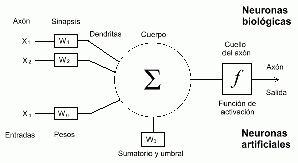
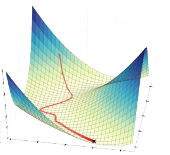

# 1. Redes Neuronales
## 1.1 Definición

Una red neuronal es un método de la inteligencia artificial que enseña a las computadoras a procesar datos de una manera que está inspirada en la forma en que lo hace el cerebro humano. Se trata de un tipo de proceso de machine learning llamado aprendizaje profundo, que utiliza los nodos o las neuronas interconectados en una estructura de capas que se parece al cerebro humano. Crea un sistema adaptable que las computadoras utilizan para aprender de sus errores y mejorar continuamente. De esta forma, las redes neuronales artificiales intentan resolver problemas complicados, como la realización de resúmenes de documentos o el reconocimiento de rostros, con mayor precisión.

<!-- 

    

 -->

## 1.2 Ejemplos
### 1.2.1 Visión artificial
La visión artificial es la capacidad que tienen las computadoras para extraer información y conocimientos de imágenes y videos. Con las redes neuronales, las computadoras pueden distinguir y reconocer imágenes de forma similar a los humanos. La visión artificial tiene varias aplicaciones, como las siguientes:

* Vehículos autónomos.
* Reconocimiento facial.
* Detección de enfermedades.

### 1.2.2 Reconocimiento de voz
Las redes neuronales pueden analizar el habla humana a pesar de los diferentes patrones de habla, el tono, el idioma y el acento. Los asistentes virtuales como Amazon Alexa y el software de transcripción automática utilizan el reconocimiento de voz para realizar tareas como las siguientes:

* Asistentes virtuales.
* Subtitulos automáticos en videos y grabaciones.

### 1.2.3 Procesamiento de lenguaje natural
El procesamiento de lenguaje natural (PLN) es la capacidad de procesar texto natural creado por humanos. Las redes neuronales ayudan a las computadoras a obtener información y significado a partir de los datos y los documentos de texto. El PLN está presente en varios casos de uso, entre los que se incluyen los siguientes:  

* Chatbots
* Clasificación de escritos.
* Análisis de sentimientos.

# 2. Esquema general de las matemáticas involucradas en las redes neuronales
## 2.1 Modelo neuronal de McCulloch-Pitts
El primer modelo matemático de una neurona artificial, creado con el fin de llevar a cabo tareas simples, fue presentado en el año 1943 en un trabajo conjunto entre el psiquiatra y neuroanatomista Warren McCulloch y el matemático Walter Pitts.

La siguiente figura muestra un ejemplo de modelo neuronal con $n$ entradas, que consta de:  

* Un conjunto de entradas $x_1, x_2, ..., x_n$.
* Los pesos sinápticos $w_1, w_2, ..., w_n$, correspondientes a cada entrada.
* Una función de agregación, $\sum$.
* Una función de activación, $f$.
* Una salida, $Y$.

<!-- 

    

 -->

## 2.2 El perceptrón multicapa
Lo prceptrones individuales pueden agruparse formando redes de neuronas conectadas entre sí (de forma que la salida de unas se convierte en la entrada de otras). Aunque la forma en que se pueden agrupar es completamente libre y variada, el caso más común de agrupación se corresponde con una organización en capas ordenadas de manera que las salidas de las neuronas de una capa son las entradas de las neuronas de la capa siguiente.  

## 2.3 Funcionamiento de una red neuronal

### 2.3.1 Propagación hacia adelante
Consiste en calcular la salida de las neuronas de cada capa, para esto, debemos multiplicar el valor de entrada (input) $x_i$ por el vector de pesos $w_i$ y sumarlos (producto punto). Podemos ver a los pesos como la fuerza de la conexión entre dos neuronas y esta decide que tanta influencia tendrá el valor de entrada en el valor de salida. Por ejemplo, si el valor $w_i$ tiene un valor mayor que $w_2$, entonces el input $x_i$ tendrá una mayor influencia en la salida que $x_2$.

$$
    \sum = (x_1 \times w_1) + (x_2 \times w_2) + ... + (x_n \times w_n)
$$

Los vectores columna de las entradas y los pesos son $x=[x_1, x_2, ..., x_n]$ y $w=[w_1, w_2, ..., w_n]$ respectivamente y su producto punto está dado por:

$$
    x\cdot w = (x_1 \times w_1) + (x_2 \times w_2) + ... + (x_n \times w_n)
$$

Por lo tanto, la sumatoria es igual al producto punto de los vectores $x$ y $w$.
$$
    \sum = x \cdot w
$$

Después debemos sumar un bias $b$ a la sumatoria de los valores multiplicados, comunmente denominamos a esto $z$.
$$
    z = x \cdot w + b
$$

Matemáticamente, el efecto de sumar estas funciones lineales en cada neurona, equivale a otra función lineal. Esto haría que si dejáramos únicamente nuestra salida con el valor de $z$ es como si toda nuestra red se colapsara en una única neurona. Es por ello que necesitamos que las salidas de las neuronas sufran una transformación no lineal. Esto se hace pasando como argumento el valor de $z$ por una función de activación no lineal. La función de activación utilizada dependerá de la tarea para la que se esté entrenando la red y de los recursos y requerimientos que se tengan.  
Algunas de las funciones de activación más comunes son:
  
- Función ReLU  
    $$
        ReLU(z) = max(0, z)
    $$  
    <!-- 

        
    
 -->
    

- Función sigmoide  
    $$
        \sigma(z) = \frac{1} {1 + e^{-z}}
    $$  
    <!-- 

        
    
 -->
    

- Función softmax  
    $$
        \sigma(z_i) = \frac{e^{z_{i}}}{\sum_{j=1}^K e^{z_{j}}} \ \ \ for\ i=1,2,\dots,K
    $$  
    <!-- 

        
    
 -->
    

Hasta aquí tenemos el proceso mediante el cuál nuestra red neuronal toma los datos de entrada, los procesa utilizando las operaciones de sus capas y nos entrega una salida. Sin embargo, en un inicio los valores de los pesos y los sesgos serán aleatorios, por lo que seguramente no obtendremos el desempeño esperado en la tarea para la que estemos aplicando la red. Es por ello que necesitamos hacer uso de algún metodo que permita mejorar estos parámetros, a lo que llamamos aprendizaje.
  
### 2.3.2 Propagación hacia atras
Es el algoritmo que nos permite actualizar los valores de los pesos y sesgos para reducir el valor de la pérdida en cada iteración.  
La idea general de la propagación hacía atras consiste en calcular el $gradiente$ de la función de pérdida, la cual depende del problema específico y que es una estimación de que tan lejos estamos de la solución deseada. Por ejemplo, para problemas de regresión, suele utilizarse el $error \ cuadrático \ medio$ y la $entropia \ cruzada$ para problemas de clasificación.  
  
Para encontrar los mejores valores de los pesos y sesgos para nuestro perceptrón, necesitamos saber cómo la función de costo cambia en relación a estos. Lo se hace con ayuda de los gradientes, que indican cómo cambia una cantidad respecto a otra. En nuestro caso, debemos calcular el gradiente de la función de costo con respecto a los pesos y sesgos.  
  
Se calcula el gradiente de la función de costo $C$ con respecto al peso $w_i$ usando derivadas parciales. Ya que la función de costo no está directamente relacionada a los pesos $w_i$, se usa la $regla \ de \ la \ cadena$.  

$$
    \frac{\partial C}{\partial w_i} = \frac{\partial C}{\partial \hat y} \times \frac{\partial \hat y}{\partial z} \times \frac{\partial z}{\partial w_i}
$$

Ahora debemos calcular los siguientes tres gradientes (se desarrolla más adelante):

$$
    \frac{\partial C}{\partial \hat y} = \ ? \ \ \ \ \ \ \ \frac{\partial \hat y}{\partial z} = \ ? \ \ \ \ \ \ \ \frac{\partial z}{\partial w_i} = \ ?
$$

Cómo se mencionó, la función de costo depende del problema que estemos atacando, estas son algunas de las funciones utilizadas comunmente según la tarea específica:

- Error cuadrático medio o MSE.
    $$
        MSE = {1\over{n}} \sum_{i=1}^{n}(y_i-\hat y_i)\ ^2
    $$
    Utilizada principalmente en problemas de regresión.

- Entropía binaria
    $$
        BCE = -{(y\log(p) + (1 - y)\log(1 - p))}
    $$
    Se suele usar en problemas de clasificación binaria.

- Entropia multiclase
    $$
        CE = -\sum_{c=1}^My_{o,c}\log(p_{o,c})
    $$
    Se suele usar en problemas de clasificación multiclase (más de dos).

### 2.3.3 Optimización
La optimización es la selección de mejores valores para los pesos y sesgos. El algoritmo más comunmente utilizado es el $descenso \ del  \ gradiente$, que cambia los $pesos$ y $sesgos$ proporcionalmente al negativo del gradiente de la función de costo con respecto a la variable correspondiente. Para ello, necesitamos también una $tasa \ de \ aprendizaje$, que se representa con el símbolo $\alpha$, que es un hiperparametro utilizado para controlar que tanto cambian los pesos y los bias.  

Los pesos y bias son actualizados de esta forma y la propagación hacia atras y el descenso del gradiente se repiten hasta alcanzar la convergencia.  
$$
\begin{aligned}
    w_i &= w_i - (\alpha \times \frac{\partial C}{\partial w_i}) \\
    b &= b - (\alpha \times \frac{\partial C}{\partial b})
\end{aligned}
$$

<!-- 

    

 -->

# 3. Problema de regresión

## 3.1 Descripción
Para ilustrar un problema de regresión utilizando redes neuronales, estimaremos los precios de casas utilizando varias propiedades de estas, como por ejemplo:
- Número de habitaciones
- Número de baños
- Número de pisos
- Año en que se construyó
- Área del terreno

Utilizando éstas y más variables, podemos entrenar una red neuronal para estimar su precio con precisión, siempre y cuando se cuente con la suficiente cantidad de datos.  
Por lo tanto, las características de las casas formarían nuestros vectores de entrada $X_i = [x_1, x_2, ..., x_n]$, siendo $i$ el índice de cada ejemplo alimentado a la red, es decir, cada casa distinta.  
Cómo valor objetivo tendremos el precio de la casa $y$, que es un número real. Este nos ayudará a calcular el error de la red comparándolo con el valor que esta prediga ($\hat y$).  
Después de mostrarle varios ejemplos a la red y actualizar los valores de sus pesos y sesgos, esperaríamos que el error sea cada vez menor, llegando a obtener una red que prediga el valor de una casa con precisión al final del entrenamiento.

# 4. Desarrollo matemático del problema

## 4.1 Definir la función de coste

Como se mencionó, el $error \ cuadrático \ medio$ es comumnente utilizado por problemas de regresión como función de perdida, esta toma el cuadrado de de las diferencias entre el valor real de ($y_i$) y el valor predicho por la red ($\hat y$). Siguiendo nuestro ejemplo, este valor sería la diferencia entre el precio real de la casa y el precio que la red le asignó, respectivamente.

$$
    MSE_i = (y_i \ - \ \hat y_i) \ ^2
$$

La función de pérdida es calculada para el conjunto de entrenamiento completo y su promedio es llamado la $función \ de \ costo C$.

$$
    C = MSE = {1\over{n}} \sum_{i=1}^{n}(y_i-\hat y_i)\ ^2
$$

## 4.2 Calculando gradientes
### 4.2.1 Gradiente de la función coste
Empecemos por calcular el gradiente de la función de coste $C$ con respecto al valor predicho $\hat y$.

$$
    \frac{\partial C}{\partial \hat y} = \frac{\partial}{\partial \hat y} = \frac{1}{n} \sum_{i=1}^{n}(y_i-\hat y_i)\ ^2 = 2 \times \frac{1}{n} (y_i-\hat y_i)\ ^2
$$

Sean $y = [y_1, \ y_2, ..., \ y_n]$ y $\hat y = [\hat y_1,\ \hat y_2,\ ...,\ \hat y_n]$ los vectores fila de los valores reales y los predichos. Por ello, la ecuación se simplifica así:

$$
    \frac{\partial C}{\partial \hat y} = \frac{2}{n} \times sum(y \ - \ \hat y)
$$

### 4.2.2 Gradiente del valor predicho respecto a la función de activación
Ahora nos toca encontrar el gradiente del valor predicho con respecto a $z$. Esto se desarrolla de la siguiente forma:

$$
\begin{aligned}
    \frac{\partial \hat y}{\partial z} &= \frac{\partial}{\partial z}\sigma (z) \\ \\
    &= \frac{\partial}{\partial z}\left( \frac{1}{1+e^{-z}} \right)\\ \\ 
    &= \frac{e^{-z}}{(1+e^{-z})^2}\\ \\ 
    &= \frac{1}{(1+e^{-z})} \times \frac{e^{-z}}{(1+e^{-z})}\\ \\ 
    &= \frac{1}{(1+e^{-z})} \times \left( 1- \frac{1}{(1+e^{-z})}\right)\\ \\ 
    &= \sigma(z) \times (1-\sigma(z))
\end{aligned}
$$

### 4.2.3 Gradiente de z respecto al peso $w_i$
$$
\begin{aligned}
    \frac{\partial z}{\partial w_i} &= \frac{\partial}{\partial w_i}(z)
    \\
    &= \frac{\partial}{\partial w_i} \sum_{i=1}^{n}\ (x_i \cdot w_i + b)
\end{aligned}
$$

Por lo tanto tenemos,
$$
\begin{aligned}
    \frac{\partial C}{\partial w_i} = \frac{2}{n} \times (y - \hat y) \times \sigma(z) \times (1-\sigma(z)) \times x_i
\end{aligned}
$$

### 4.2.4 Gradiente de la función coste con respecto al sesgo
$$
\begin{aligned}
    \frac{\partial C}{\partial b_i} = \frac{2}{n} \times (y - \hat y) \times \sigma(z) \times (1-\sigma(z))
\end{aligned}
$$

## 4.3 Actualizando los valores de los pesos y los sesgos
Ahora que hemos calculado los gradientes para los pesos y los bias, podemos actualizar sus valores dependiendo del error de nuestra red en cada iteración.

$$
\begin{aligned}
    w_i &= w_i - (\alpha \times \frac{\partial C}{\partial w_i}) \\
    b &= b - (\alpha \times \frac{\partial C}{\partial b})
\end{aligned}
$$

Al ir actualizando los valores de los pesos y los sesgos en cada iteración, el valor de la función de coste, y por lo tanto, el error, deberían disminuir hasta alcanzar la convergencia.  

Si entrenamos nuestra red con una cantidad suficiente de datos y por un número de iteraciones adecuado, deberíamos esperar que sea capaz de estimar el precio de una casa de forma satisfactoria utilizando sus características.

# 6. Referencias
[1] ¿Qué es una red neuronal? - Explicación de las redes neuronales artificiales - AWS. (n.d.). Amazon Web Services, Inc. https://aws.amazon.com/es/what-is/neural-network/#:~:text=Una%20red%20neuronal%20es%20un,lo%20hace%20el%20cerebro%20humano.

[2] K, D. S. (2022, March 5). An Introduction To Mathematics Behind Neural Networks  | Towards Data Science. Medium. https://towardsdatascience.com/introduction-to-math-behind-neural-networks-e8b60dbbdeba

[3] ¿Qué son las redes neuronales?  | IBM. (n.d.). https://www.ibm.com/mx-es/topics/neural-networks

[4] N, S. B. (2002, June 30). Redes neuronales: concepto, aplicaciones y utilidad en medicina. Atención Primaria. https://www.elsevier.es/es-revista-atencion-primaria-27-articulo-redes-neuronales-concepto-aplicaciones-utilidad-13033737

[5] Dot CSV. (2018a, March 19). ¿Qué es una Red Neuronal?  Parte 1 : La Neurona | DotCSV [Video]. YouTube. https://www.youtube.com/watch?v=MRIv2IwFTPg

[6] Dot CSV. (2018b, May 28). ¿Qué es una Red Neuronal? Parte 2 : La Red | DotCSV [Video]. YouTube. https://www.youtube.com/watch?v=uwbHOpp9xkc

[7] Dot CSV. (2018c, October 3). ¿Qué es una Red Neuronal? Parte 3 : Backpropagation | DotCSV [Video]. YouTube. https://www.youtube.com/watch?v=eNIqz_noix8
